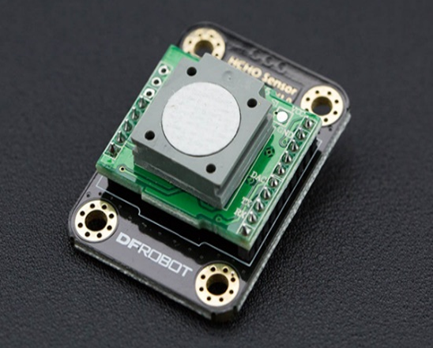
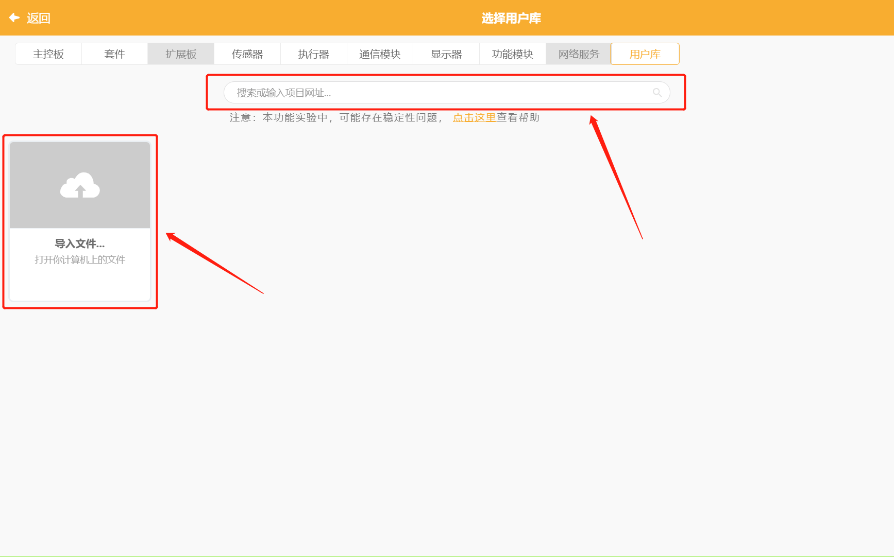
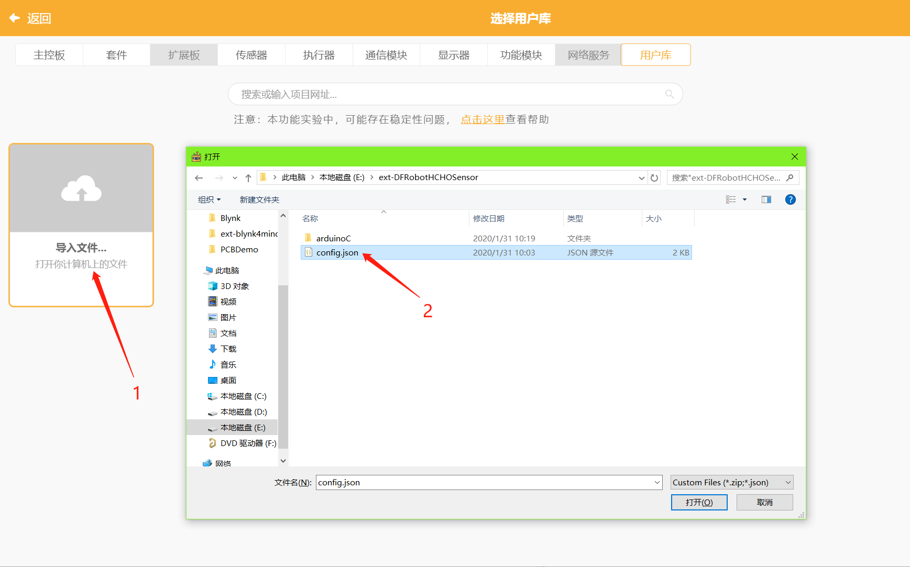
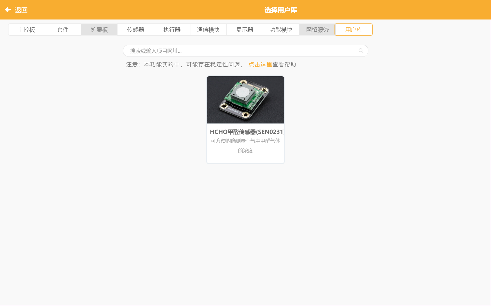
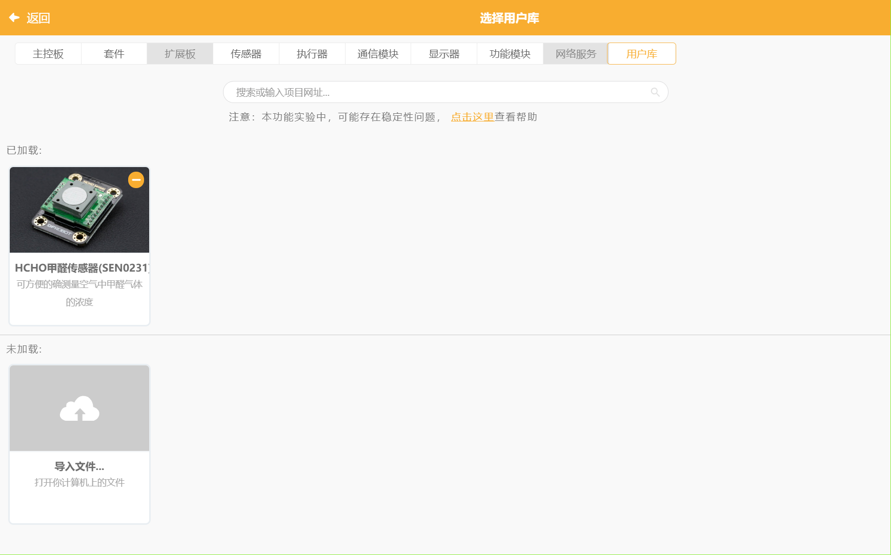
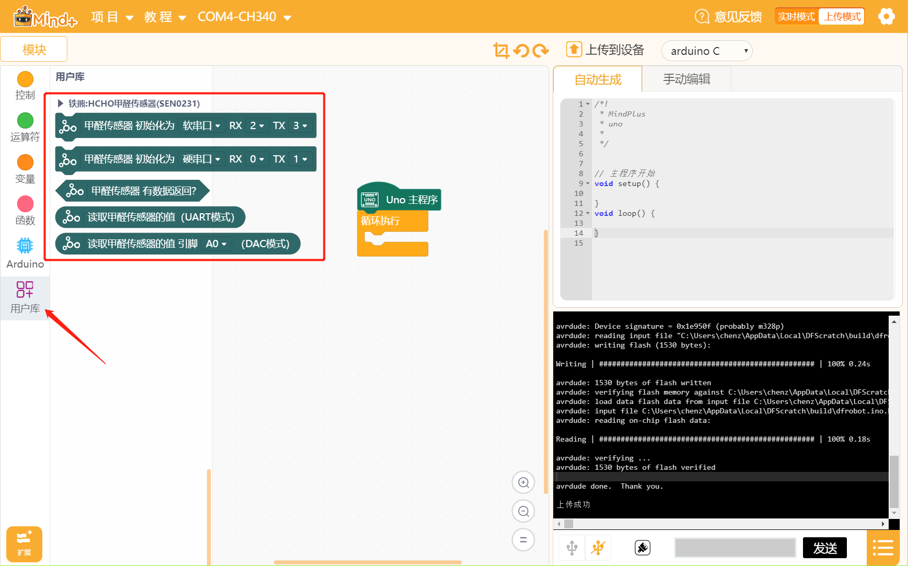
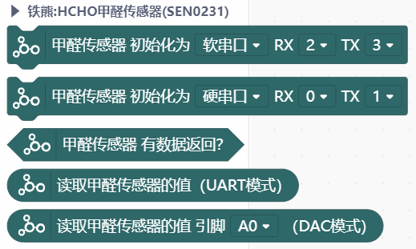
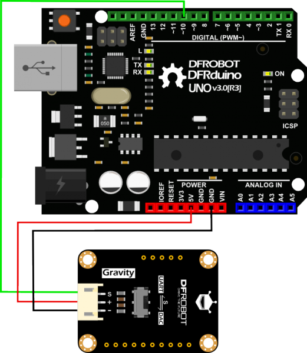
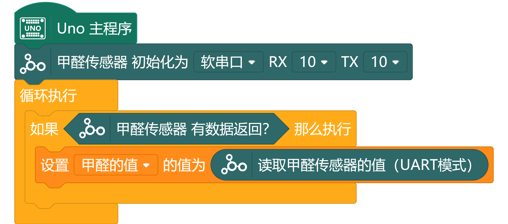
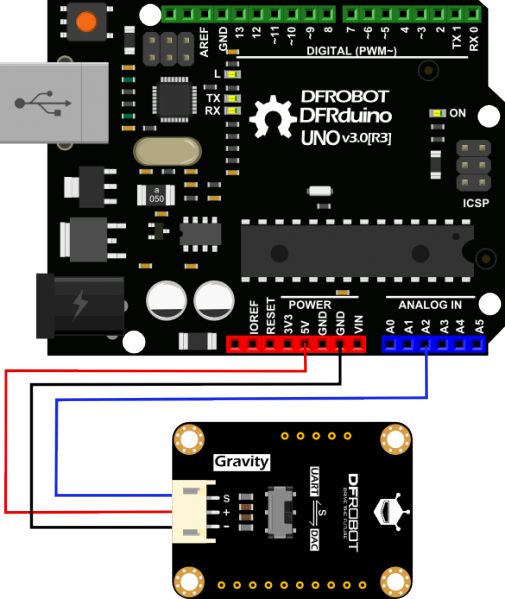

# HCHO 甲醛传感器 Mind+ 用户库

## 链接

- **本用户库加载地址：**

  GitHub：[https://github.com/chenzhongxian/ext-DFRobotHCHOSensor](https://github.com/chenzhongxian/ext-DFRobotHCHOSensor)

  或：码云（推荐国内用户使用）：[https://gitee.com/ironpanda/ext-DFRobotHCHOSensor](https://gitee.com/ironpanda/ext-DFRobotHCHOSensor) 

- **Mind+ 软件下载地址：**[http://mindplus.cc](http://mindplus.cc)

## 简介

- **产品链接：**[https://www.dfrobot.com.cn/goods-1373.html](https://www.dfrobot.com.cn/goods-1373.html)
- **介绍：**本扩展库为 DFRobot HCHO甲醛传感器（SEN0231）设计，支持 Mind+ 导入库

## 导入教程

在 Mind+ 中选择用户库，然后输入网址或者点击“导入文件”即可。

以导入文件方式为例，点击“导入文件”，在弹出的资源管理器中，定位到库文件路径，然后选择config.json文件，即可完成导入。

导入成功后，就会出现相应的传感器库可供选择

点击相应的用户库进行选择，就会出现在“已加载”分类中，与自带库的操作一致。

回到 Mind+ 主界面，这时就可以在“用户库”分类中看到刚才选择的传感器的对应图形模块。

## Blocks

## 示例

本示例将演示如何使用这款甲醛传感器来测量空气中甲醛的浓度值。
接线方式分两种，分别是 UART 模式与 DAC 模式。

### UART 模式

使用UART模式前，请先将拨码开关切换到 UART 一端。

接线图：

Mind+示例程序：

### DAC 模式

使用 DAC 模式前，请先将拨码开关切换到 DAC 一端。

> DAC模式中，测量精度会受主控器ADC的位数、参考电压精度的影响，因此请使用高精度的电源给主控器供电，或者直接使用主控器的内部参考电压。而且主控器的ADC至少是10位。

接线图：

Mind+示例程序：

## License

MIT

## 硬件支持

MCU                | JavaScript    | Arduino   | MicroPython    | Remarks
------------------ | :----------: | :----------: | :---------: | -----
micro:bit        |             |       √       |             | 
mPython（掌控版）        |             |        √      |             | 
Arduino Uno    |             |        √      |             | 

## 更新日志

- V0.1.0 20200131 第一版发布

